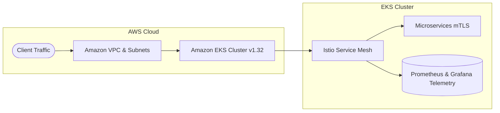

# Terraform EKS Service Mesh & Observability

Infrastructure fully provisioned as code (IaC) with Terraform, deploying an Amazon EKS cluster integrated with Istio Service Mesh (mTLS) and an observability stack.


## Architecture



This repository provisions a modular AWS cloud environment:
- **VPC Module**: Custom networking setup with public/private subnets and NAT Gateways.
- **EKS Module**: Managed Kubernetes cluster (v1.32).
- **AWS Load Balancer Controller**: Ingress and traffic management.
- **Istio Module**: Service mesh deployment enforcing secure **mTLS** communication.
- **Monitoring Module**: Prometheus and Grafana observability stack.

## Project Structure

```text
terraform-eks-service-mesh-observability/
├── modules/
│   ├── aws-load-balancer-controller/
│   ├── eks/
│   ├── istio/
│   ├── monitoring/
│   └── vpc/
├── main.tf
├── variables.tf
├── outputs.tf
└── versions.tf
```

---

## Prerequisites

* AWS CLI configured with active credentials.
* Terraform >= 1.5.0 installed.
* kubectl and istioctl installed locally.

---

## Deployment

1. Clone the repository:
```powershell
   git clone [https://github.com/tatan461/terraform-eks-service-mesh-observability.git](https://github.com/tatan461/terraform-eks-service-mesh-observability.git)
   cd terraform-eks-service-mesh-observability
```
2. Deploy infrastructure using Terraform:
```powershell
   cd terraform
   terraform init
   terraform apply -auto-approve
```
3. Configure local Kubernetes context:
```powershell
   aws eks update-kubeconfig --region <your-region> --name <your-cluster-name>
```
## Service Mesh & Validation Workflow

1. Enable Istio sidecar injection in target namespace:
```powershell
   kubectl create namespace test-app
   kubectl label namespace test-app istio-injection=enabled --overwrite
```  
2. Validate mTLS end-to-end connectivity:
Run a temporary curl container inside the mesh to test strict mTLS traffic:
```powershell
   kubectl run curl-test -n test-app --image=curlimages/curl -it --rm --restart=Never -- curl -s http://nginx-clean
```
## Observability (Grafana & Prometheus)

1. Access Grafana Dashboard:
Forward Grafana service port to inspect mesh metrics and telemetry:
```powershell
   kubectl port-forward svc/grafana 3000:3000 -n istio-system
```
Access Grafana locally at http://localhost:3000.

## Teardown & Resource Cleanup
To avoid unexpected charges in your AWS account, clean up test pods and tear down all Terraform-managed resources:

1. Remove Kubernetes workloads:
```powershell
   kubectl delete namespace test-app --ignore-not-found
```
2. Destroy AWS Infrastructure:
```powershell
   terraform destroy --auto-approve
```


   